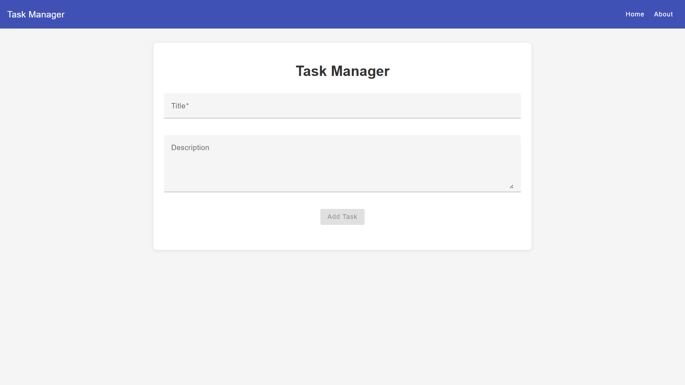

# 📝 TaskManager



**TaskManager** is a single-page web application built with Angular (v19) and Angular Material. It delivers an intuitive, responsive interface for creating, editing, completing, and deleting tasks. All data is automatically persisted in your browser's localStorage to survive page reloads.

---

## 🚀 Features

- ✅ Add and manage tasks through a dynamic form
- 📝 Edit existing tasks
- 🎯 Mark tasks as complete or undo completion
- 🗑️ Remove tasks with one click
- 💾 Automatic persistence in localStorage
- 📱 Fully responsive UI built on Angular Material

---

## 🛠️ Tech Stack

- Angular CLI v19.2.10
- Angular Material
- TypeScript
- SCSS
- RxJS

---

## ▶️ Getting Started

### Installation

```bash
git clone https://github.com/tihomirpetrov/taskmanager.git
cd taskmanager
npm install
